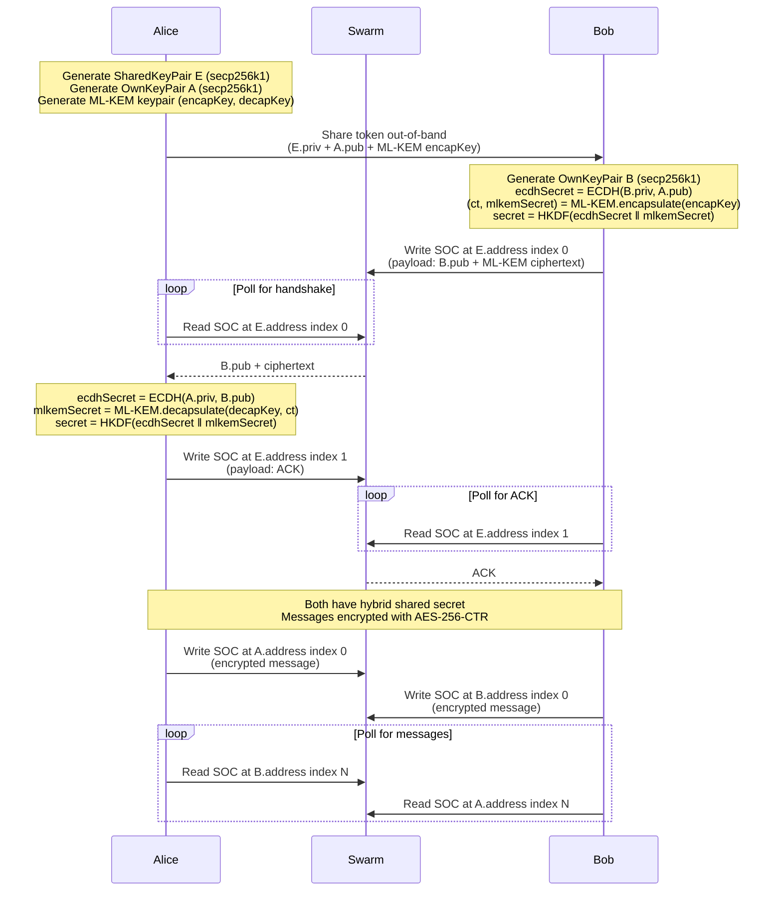

### Swapchat Engine

Decentralized E2E encrypted chat on Ethereum Swarm using Single Owner Chunks (SOCs).

Implementing [swapchat protocol pre-release 1.0](./swapchat-protocol.txt) (credits @agazo & @nolash)

SOCs are constructed and signed client-side in JavaScript, then uploaded as raw chunks via `POST /chunks`. No dependency on the bee node's signer.

### Cryptography

- **Key exchange**: Hybrid ML-KEM-768 + secp256k1 ECDH (post-quantum + classical)
- **Message encryption**: AES-256-CTR with message index as IV
- **Hashing**: Keccak-256 (via js-sha3)
- **KDF**: HKDF-SHA256 to combine ECDH and ML-KEM shared secrets
- **SOC signing**: secp256k1 ECDSA (via bee-js / cafe-utility)

ML-KEM is purely lattice-based (FIPS 203). The hybrid approach combines both at the protocol level — if either primitive is broken, the other still protects.

### Protocol



### Setup

```
nvm use
npm install
```

### Running tests

Requires a running Bee node.

```
BEE_API_URL=http://localhost:1633 \
BEE_STAMP_ID=<your-stamp-id> \
npx jest --forceExit
```

Environment variables:
- `BEE_API_URL` — Bee node API URL (default: `http://localhost:1633`)
- `BEE_STAMP_ID` — Pre-bought postage stamp batch ID (skips buying a new stamp per test run)

### Build

```
npm run build   # TypeScript → dist/tsc/
npm run pack    # Webpack bundle → dist/web/swapchat_engine.js
```
