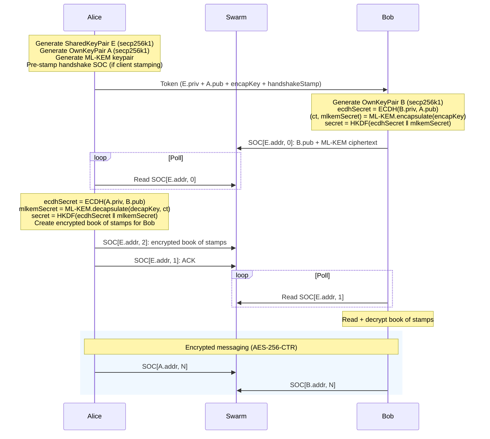

# Swapchat Engine

Decentralized E2E encrypted chat on Ethereum Swarm. Messages stored as Single Owner Chunks (SOCs), constructed and signed client-side. Post-quantum hybrid key exchange. Zero-BZZ onboarding for respondents.

## API

### Quick start

```typescript
import SwapChat from "swapchat";

// Alice creates a session
const alice = new SwapChat("http://localhost:1633", onMessage, false, 5000);
alice.BatchID = "<stamp-id>";         // or use SignerKey for client-side stamping
await alice.initiate();
const token = alice.getToken();       // share this with Bob (base64url, ~1859 chars)

// Bob joins
const bob = new SwapChat("http://localhost:1633", onMessage, false, 5000);
bob.BatchID = "<stamp-id>";           // not needed if Alice uses client-side stamping
await bob.respond(token);

// Complete handshake
await alice.waitForRespondentHandshakeChunk();
await bob.waitForInitiatorHandshakeChunk();

// Chat
await alice.send("hello");
await bob.send("hey!");

// Messages arrive via callback
function onMessage(msg) {
  console.log(msg.content, msg.timestamp);
}
```

### Constructor

```typescript
new SwapChat(apiURL, didReceiveCallback, gatewayMode, pollMilliseconds)
```

| Param | Type | Description |
|-------|------|-------------|
| `apiURL` | `string` | Bee node API URL |
| `didReceiveCallback` | `(msg: Message) => void` | Called when a message is received |
| `gatewayMode` | `boolean` | Use zero stamp (gateway nodes) |
| `pollMilliseconds` | `number` | Polling interval for new messages |

### Properties (set before `initiate`/`respond`)

| Property | Type | Description |
|----------|------|-------------|
| `BatchID` | `string` | Postage stamp batch ID |
| `SignerKey` | `string` | Hex private key for client-side stamping |
| `StampDepth` | `number` | Batch depth (default: 20) |
| `StampBuckets` | `Uint32Array` | Restored stamp state (from `getStampState()`) |

### Methods

| Method | Returns | Description |
|--------|---------|-------------|
| `initiate()` | `Promise<this>` | Start a new chat session as initiator |
| `getToken()` | `string` | Get base64url token to share with respondent |
| `respond(token)` | `Promise<this>` | Join a session using a token |
| `waitForRespondentHandshakeChunk()` | `Promise<void>` | Initiator: poll until respondent completes handshake |
| `waitForInitiatorHandshakeChunk()` | `Promise<void>` | Respondent: poll until initiator sends ACK |
| `send(message)` | `Promise<boolean>` | Send an encrypted message |
| `close()` | `void` | Stop polling |
| `getRestorationToken()` | `string` | Get hex token for session persistence |
| `restoreFromToken(token)` | `this` | Restore a session from a restoration token |

### Message format

```typescript
interface Message {
  index: number;
  content: string;
  timestamp: number;
}
```

### Stamp state persistence

```typescript
// Save stamp state (e.g. to localStorage)
const state = alice.Swarm.getStampState(); // Uint32Array

// Restore on next session
alice.StampBuckets = savedState;
```

## Client-side stamping (zero-BZZ respondent)

When the initiator sets `SignerKey`, two things happen automatically:

1. A **handshake stamp** is embedded in the token — the respondent uses it to write their handshake SOC
2. A **book of stamps** (36 pre-signed, encrypted stamps) is sent after handshake — the respondent uses them to send messages

The respondent needs zero BZZ or xDAI.

```typescript
// Initiator (has BZZ)
const alice = new SwapChat(apiURL, onMessage, false, 5000);
alice.SignerKey = "<hex-private-key>";
alice.BatchID = "<stamp-id>";
await alice.initiate();
const token = alice.getToken(); // includes handshake stamp

// Respondent (no BZZ needed)
const bob = new SwapChat(apiURL, onMessage, false, 5000);
await bob.respond(token);       // uses handshake stamp from token
// after handshake, bob reads encrypted book of stamps
// bob.send() uses pre-signed stamps — up to 36 messages
```

To buy a stamp on Gnosis Chain:

```bash
BEE_SIGNER_KEY=<hex-private-key> ./scripts/buy-stamp.sh
```

Calls the [PostageStamp contract](https://github.com/ethersphere/storage-incentives) via `cast` ([Foundry](https://getfoundry.sh)).

## Protocol

### Cryptography

| Component | Algorithm |
|-----------|-----------|
| Key exchange | Hybrid ML-KEM-768 + secp256k1 ECDH |
| Message encryption | AES-256-CTR |
| Hashing | Keccak-256 |
| KDF | HKDF-SHA256 |
| SOC signing | secp256k1 ECDSA |
| Curve | secp256k1 (nothing-up-my-sleeve parameters) |

ML-KEM is purely lattice-based (FIPS 203). The hybrid combines both at the protocol level — if either is broken, the other still protects.

### Handshake



### Token format (base64url, 1394 bytes)

| Field | Bytes |
|-------|-------|
| Shared secp256k1 private key | 32 |
| Initiator secp256k1 public key | 65 |
| ML-KEM-768 encapsulation key | 1,184 |
| Handshake stamp | 113 |
| **Total** | **1,394** |

### Book of stamps

36 pre-signed postage stamps packed into one SOC (36 × 113 = 4,068 bytes), encrypted with AES-256-CTR using the shared secret.

## Setup

```
nvm use
npm install
```

## Tests

```bash
# Server-side stamping only
BEE_API_URL=http://localhost:1633 \
BEE_STAMP_ID=<node-stamp> \
npx jest --forceExit

# With client-side stamping + book of stamps
BEE_API_URL=http://localhost:1633 \
BEE_STAMP_ID=<node-stamp> \
BEE_SIGNER_KEY=<hex-key> \
BEE_CLIENT_STAMP_ID=<signer-stamp> \
BEE_STAMP_DEPTH=20 \
npx jest --forceExit
```

## Build

```
npm run build   # TypeScript → dist/tsc/
npm run pack    # Webpack → dist/web/swapchat_engine.js
```
