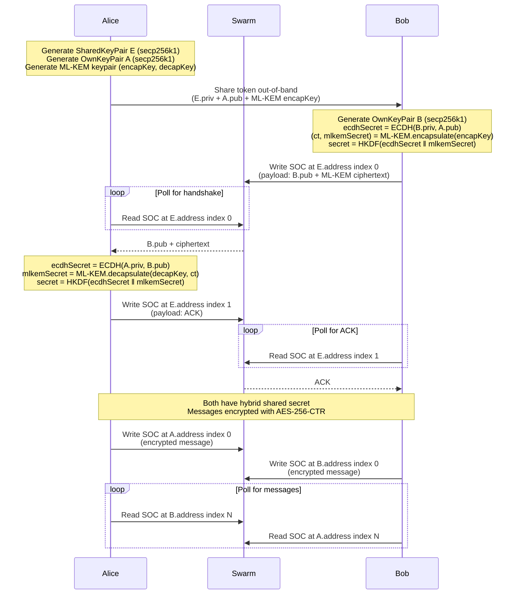
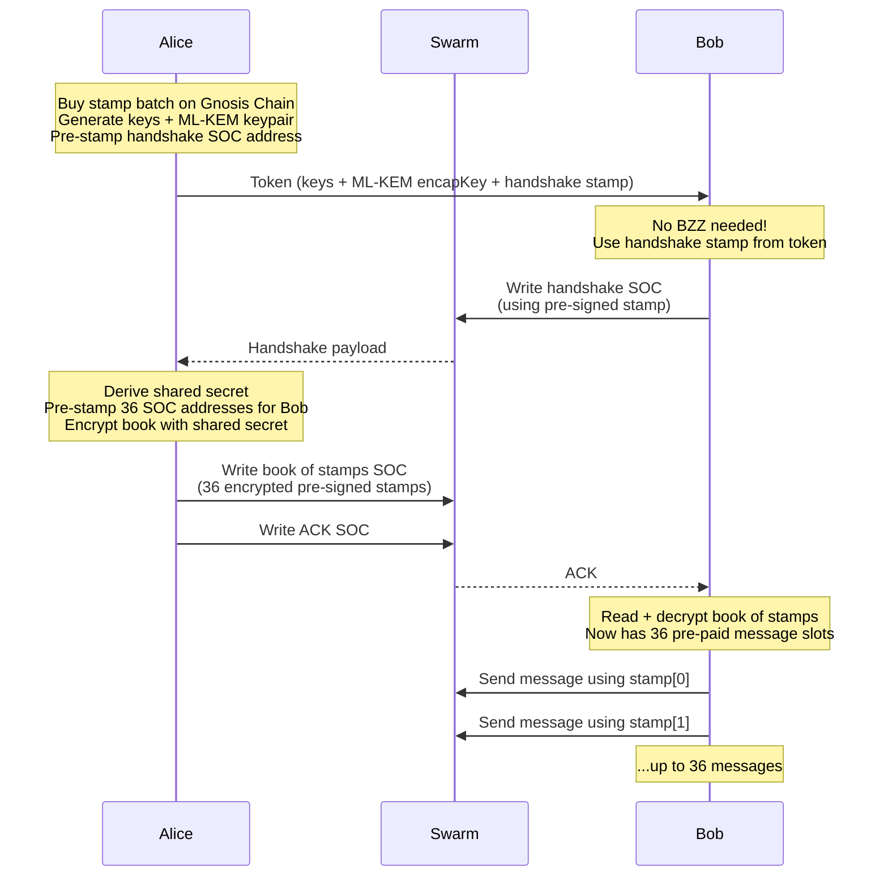

### Swapchat Engine

Decentralized E2E encrypted chat on Ethereum Swarm using Single Owner Chunks (SOCs).

Implementing [swapchat protocol pre-release 1.0](./swapchat-protocol.txt) (credits @agazo & @nolash)

SOCs are constructed and signed client-side in JavaScript, then uploaded as raw chunks via `POST /chunks`. No dependency on the bee node's signer.

### Cryptography

- **Key exchange**: Hybrid ML-KEM-768 + secp256k1 ECDH (post-quantum + classical)
- **Message encryption**: AES-256-CTR with message index as IV
- **Hashing**: Keccak-256 (via js-sha3)
- **KDF**: HKDF-SHA256 to combine ECDH and ML-KEM shared secrets
- **SOC signing**: secp256k1 ECDSA (via bee-js / cafe-utility)

ML-KEM is purely lattice-based (FIPS 203). The hybrid approach combines both at the protocol level — if either primitive is broken, the other still protects.

### Protocol



### Setup

```
nvm use
npm install
```

### Book of Stamps (Zero-BZZ Respondent)

The initiator can sponsor the respondent so they need zero BZZ or xDAI to chat. During the handshake, the initiator pre-signs postage stamps for all SOC addresses the respondent will use and sends them as an encrypted "book of stamps".



### Stamping

Three modes:

**Server-side stamping** (default): pass a batch ID and the bee node signs the stamp.

**Client-side stamping**: set `SignerKey` and `BatchID` on the initiator. Stamps chunks locally in JavaScript.

**Book of stamps** (zero-BZZ respondent): when the initiator uses client-side stamping, they automatically create a book of stamps for the respondent. The respondent needs nothing — stamps come from the token (handshake) and book (messages).

To buy a stamp for client-side use, fund an address with BZZ + xDAI on Gnosis Chain, then:

```
BEE_SIGNER_KEY=<hex-private-key> ./scripts/buy-stamp.sh
```

This calls the [PostageStamp contract](https://github.com/ethersphere/storage-incentives) via `cast` (Foundry).

### Running tests

Requires a running Bee node.

```bash
# Server-side stamping only
BEE_API_URL=http://localhost:1633 \
BEE_STAMP_ID=<node-owned-stamp> \
npx jest --forceExit

# With client-side stamping tests
BEE_API_URL=http://localhost:1633 \
BEE_STAMP_ID=<node-owned-stamp> \
BEE_SIGNER_KEY=<hex-private-key> \
BEE_CLIENT_STAMP_ID=<signer-owned-stamp> \
BEE_STAMP_DEPTH=20 \
npx jest --forceExit
```

Environment variables:
- `BEE_API_URL` — Bee node API URL (default: `http://localhost:1633`)
- `BEE_STAMP_ID` — Node-owned stamp batch ID (server-side stamping)
- `BEE_SIGNER_KEY` — Hex private key of the batch owner (client-side stamping)
- `BEE_CLIENT_STAMP_ID` — Signer-owned stamp batch ID (client-side stamping)
- `BEE_STAMP_DEPTH` — Batch depth (default: `20`)

### Build

```
npm run build   # TypeScript → dist/tsc/
npm run pack    # Webpack bundle → dist/web/swapchat_engine.js
```
