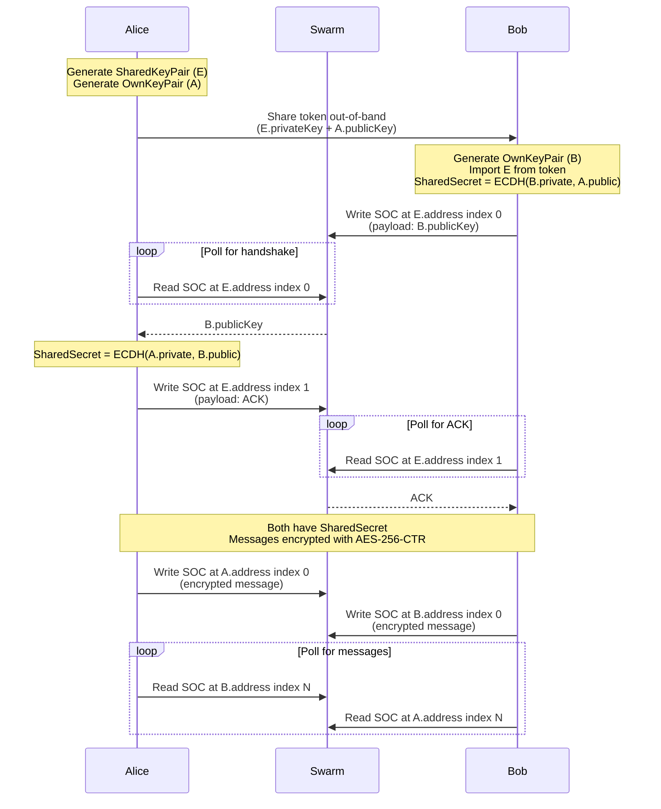

### Swapchat Engine

Decentralized E2E encrypted chat on Ethereum Swarm using Single Owner Chunks (SOCs).

Implementing [swapchat protocol pre-release 1.0](./swapchat-protocol.txt) (credits @agazo & @nolash)

SOCs are constructed and signed client-side in JavaScript, then uploaded as raw chunks via `POST /chunks`. No dependency on the bee node's signer.

### Protocol



Each message is encrypted with AES-256-CTR using the shared secret and the message index as IV. Messages are stored as SOCs at each party's own address, indexed sequentially.

### Setup

```
nvm use
npm install
```

### Running tests

Requires a running Bee node.

```
BEE_API_URL=http://localhost:1633 \
BEE_STAMP_ID=<your-stamp-id> \
npx jest --forceExit
```

Environment variables:
- `BEE_API_URL` — Bee node API URL (default: `http://localhost:1633`)
- `BEE_STAMP_ID` — Pre-bought postage stamp batch ID (skips buying a new stamp per test run)

### Build

```
npm run build   # TypeScript → dist/tsc/
npm run pack    # Webpack bundle → dist/web/swapchat_engine.js
```
