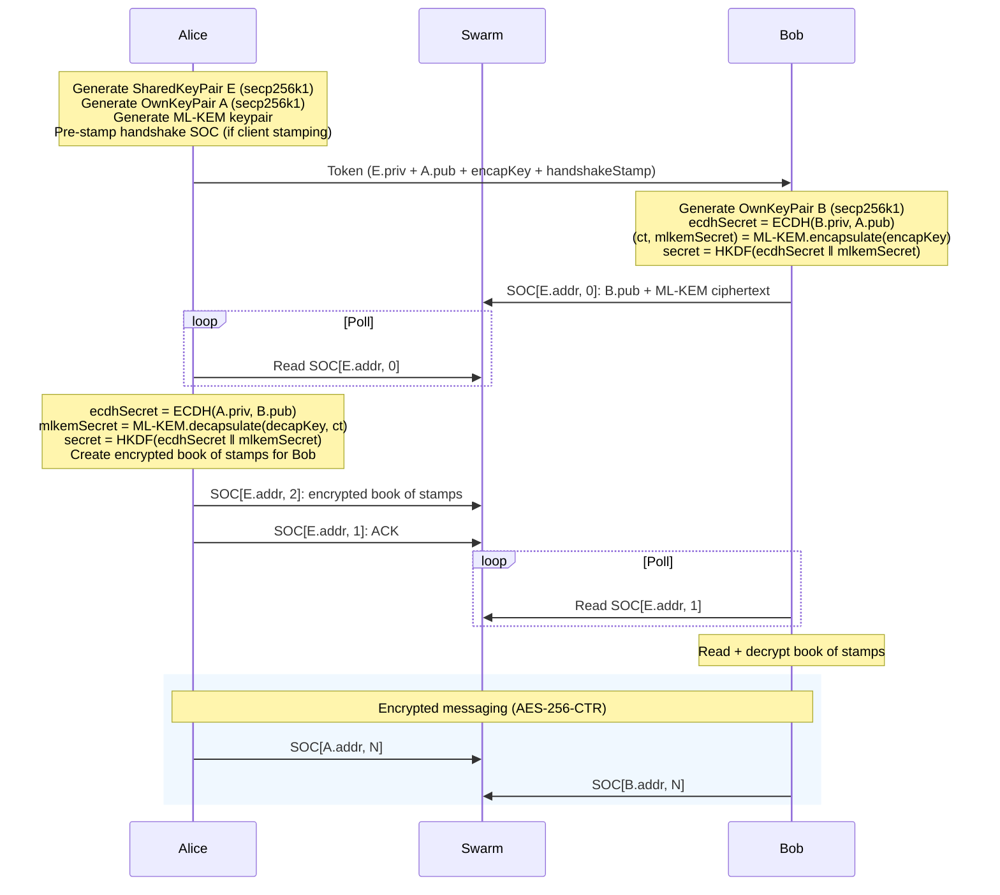

# Swapchat Engine

Decentralized E2E encrypted chat on Ethereum Swarm. Messages stored as Single Owner Chunks (SOCs), constructed and signed client-side. Post-quantum hybrid key exchange. Zero-BZZ onboarding for respondents.

| Feature | Status | |
|---------|--------|-|
| Post-quantum SOC handshake (ML-KEM-768 + ECDH) | ✅ | :crystal_ball: |
| Browser-stamped chunks (client-side postage signing) | ✅ | :postbox: |
| Book of stamps onboarding (zero BZZ for respondent) | ✅ | :ticket: |
| Browser security context (no server, no keys leave device) | ✅ | :lock: |
| Up to 36 fixed-size 4KB messages per conversation | ✅ | :envelope: |
| Completely decentralised (Swarm network only) | ✅ | :globe_with_meridians: |

## API

### Quick start

```typescript
import SwapChat from "swapchat";

// Alice creates a session
const alice = new SwapChat("http://localhost:1633", onMessage, false, 5000);
alice.BatchID = "<stamp-id>";         // or use SignerKey for client-side stamping
await alice.initiate();
const token = alice.getToken();       // share this with Bob (base64url, ~1859 chars)

// Bob joins
const bob = new SwapChat("http://localhost:1633", onMessage, false, 5000);
bob.BatchID = "<stamp-id>";           // not needed if Alice uses client-side stamping
await bob.respond(token);

// Complete handshake
await alice.waitForRespondentHandshakeChunk();
await bob.waitForInitiatorHandshakeChunk();

// Chat
await alice.send("hello");
await bob.send("hey!");

// Messages arrive via callback
function onMessage(msg) {
  console.log(msg.content, msg.timestamp);
}
```

### Constructor

```typescript
new SwapChat(apiURL, didReceiveCallback, gatewayMode, pollMilliseconds, socGatewayURL?, readTimeoutMs?)
```

| Param | Type | Description |
|-------|------|-------------|
| `apiURL` | `string` | Bee node or gateway URL |
| `didReceiveCallback` | `(msg: Message) => void` | Called when a message is received |
| `gatewayMode` | `boolean` | Use zero stamp (gateway nodes) |
| `pollMilliseconds` | `number` | Polling interval for new messages |
| `socGatewayURL` | `string?` | Optional separate URL for SOC uploads (defaults to `apiURL`) |
| `readTimeoutMs` | `number?` | Chunk retrieval timeout in ms (omit for public gateways to avoid CORS issues) |

### Properties (set before `initiate`/`respond`)

| Property | Type | Description |
|----------|------|-------------|
| `BatchID` | `string` | Postage stamp batch ID |
| `SignerKey` | `string` | Hex private key for client-side stamping |
| `StampDepth` | `number` | Batch depth (default: 20) |
| `StampBuckets` | `Uint32Array` | Restored stamp state (from `getStampState()`) |

### Methods

| Method | Returns | Description |
|--------|---------|-------------|
| `initiate()` | `Promise<this>` | Start a new chat session as initiator |
| `getToken()` | `string` | Get base64url token to share with respondent |
| `respond(token)` | `Promise<this>` | Join a session using a token |
| `waitForRespondentHandshakeChunk()` | `Promise<void>` | Initiator: poll until respondent completes handshake |
| `waitForInitiatorHandshakeChunk()` | `Promise<void>` | Respondent: poll until initiator sends ACK |
| `send(message)` | `Promise<boolean>` | Send an encrypted message |
| `close()` | `void` | Stop polling |
| `getRestorationToken()` | `string` | Get hex token for session persistence |
| `restoreFromToken(token)` | `this` | Restore a session from a restoration token |
| `Swarm.validateStampBatch()` | `Promise<boolean>` | Check if stamp batch is valid by uploading a test chunk |
| `Swarm.getStampState()` | `Uint32Array` | Export stamp bucket state for persistence |

### Limits

| Limit | Value | Reason |
|-------|-------|--------|
| Message size | 2 KB | Fits in single padded chunk |
| Chunk size | 4,096 bytes | All chunks padded to max to prevent side-channel analysis |
| Book of stamps | 36 messages | Max stamps per SOC payload |

### Message format

```typescript
interface Message {
  index: number;
  content: string;
  timestamp: number;
}
```

### Stamp state persistence

```typescript
// Save stamp state (e.g. to localStorage)
const state = alice.Swarm.getStampState(); // Uint32Array

// Restore on next session
alice.StampBuckets = savedState;
```

## Client-side stamping (zero-BZZ respondent)

When the initiator sets `SignerKey`, two things happen automatically:

1. A **handshake stamp** is embedded in the token — the respondent uses it to write their handshake SOC
2. A **book of stamps** (36 pre-signed, encrypted stamps) is sent after handshake — the respondent uses them to send messages

The respondent needs zero BZZ or xDAI.

```typescript
// Initiator (has BZZ)
const alice = new SwapChat(apiURL, onMessage, false, 5000);
alice.SignerKey = "<hex-private-key>";
alice.BatchID = "<stamp-id>";
await alice.initiate();
const token = alice.getToken(); // includes handshake stamp

// Respondent (no BZZ needed)
const bob = new SwapChat(apiURL, onMessage, false, 5000);
await bob.respond(token);       // uses handshake stamp from token
// after handshake, bob reads encrypted book of stamps
// bob.send() uses pre-signed stamps — up to 36 messages
```

To buy a stamp on Gnosis Chain:

```bash
BEE_SIGNER_KEY=<hex-private-key> ./scripts/buy-stamp.sh
```

Calls the [PostageStamp contract](https://github.com/ethersphere/storage-incentives) via `cast` ([Foundry](https://getfoundry.sh)).

## Protocol

### Cryptography

| Component | Algorithm |
|-----------|-----------|
| Key exchange | Hybrid ML-KEM-768 + secp256k1 ECDH |
| Message encryption | AES-256-CTR |
| Hashing | Keccak-256 |
| KDF | HKDF-SHA256 |
| SOC signing | secp256k1 ECDSA |
| Curve | secp256k1 (nothing-up-my-sleeve parameters) |

ML-KEM is purely lattice-based (FIPS 203). The hybrid combines both at the protocol level — if either is broken, the other still protects.

### Handshake



### Token format (base64url, 1394 bytes)

| Field | Bytes |
|-------|-------|
| Shared secp256k1 private key | 32 |
| Initiator secp256k1 public key | 65 |
| ML-KEM-768 encapsulation key | 1,184 |
| Handshake stamp | 113 |
| **Total** | **1,394** |

### Book of stamps

36 pre-signed postage stamps packed into one SOC (36 × 113 = 4,068 bytes), encrypted with AES-256-CTR using the shared secret.

## Security model

### 1. Notation

| Symbol | Meaning |
|--------|---------|
| _A_ | Initiator (Alice) |
| _B_ | Respondent (Bob) |
| _M_ | Adversary (Mallory) |
| _(sk, pk)_ | secp256k1 private/public key pair |
| _E_ | Shared ephemeral key pair, generated by _A_ |
| _ek_, _dk_ | ML-KEM-768 encapsulation / decapsulation keys |
| _ct_ | ML-KEM ciphertext |
| _s<sub>ecdh</sub>_ | ECDH shared secret: _ECDH(sk<sub>x</sub>, pk<sub>y</sub>)_ |
| _s<sub>kem</sub>_ | ML-KEM shared secret from encapsulate/decapsulate |
| _S_ | Final session secret: _HKDF-SHA256(s<sub>ecdh</sub> &#124;&#124; s<sub>kem</sub>, info="swapchat-hybrid")_ |
| _V_ | Verification code: first 3 bytes of _keccak256(S)_, displayed as 6 hex chars |
| _SOC[addr, i]_ | Single Owner Chunk at owner _addr_, index _i_ |
| _E<sub>k</sub>(m)_ | AES-256-CTR encryption of _m_ under key _k_ |

### 2. Key exchange

The token transmitted from _A_ to _B_ contains:

```
T = E.sk || A.pk || ek || stamp    (1,394 bytes)
```

_B_ generates a fresh key pair _(sk<sub>B</sub>, pk<sub>B</sub>)_ and computes:

```
s_ecdh  = ECDH(sk_B, A.pk)
(ct, s_kem) = ML-KEM.Encapsulate(ek)
S_B     = HKDF-SHA256(s_ecdh || s_kem, info="swapchat-hybrid")
```

_B_ writes _pk<sub>B</sub> || ct_ to _SOC[E.addr, 0]_. _A_ reads it and computes:

```
s_ecdh  = ECDH(sk_A, pk_B)
s_kem   = ML-KEM.Decapsulate(dk, ct)
S_A     = HKDF-SHA256(s_ecdh || s_kem, info="swapchat-hybrid")
```

By the correctness of ECDH and ML-KEM: _S<sub>A</sub> = S<sub>B</sub> = S_.

The hybrid construction is a concatenation KDF: _S_ is secure if **either** the ECDH problem on secp256k1 **or** ML-KEM-768 remains hard. This provides classical security from ECDH and post-quantum security from ML-KEM, protecting against harvest-now-decrypt-later attacks.

### 3. Verification code

Both parties compute:

```
V = keccak256(S)[0..3]    (6 hex characters)
```

_V_ is a 24-bit fingerprint of the shared secret. If _A_ and _B_ completed the same key exchange, they hold the same _S_ and therefore the same _V_.

**Collision probability.** For a random adversary attempting to produce a matching _V_ without knowing _S_: _P(match) = 2<sup>-24</sup> = 1/16,777,216_. This is not a brute-force target since the adversary cannot iterate: each attempt requires a fresh handshake producing a fresh _S_.

### 4. Threat analysis

#### 4.1 Passive eavesdropping

**Attacker model.** _M_ observes all Swarm network traffic, including every chunk stored and retrieved. _M_ does not intercept the token.

**What _M_ sees:**
- _SOC[E.addr, 0]_: _pk<sub>B</sub> || ct_ (public values)
- _SOC[E.addr, 1]_: ACK (uninformative)
- _SOC[E.addr, 2]_: _E<sub>S</sub>(book of stamps)_ (ciphertext)
- _SOC[A.addr, n]_, _SOC[B.addr, n]_: _E<sub>S</sub>(padded message)_ (ciphertext)

**What _M_ needs:** _S = HKDF(ECDH(sk<sub>A</sub>, pk<sub>B</sub>) || ML-KEM.Decap(dk, ct))_

_M_ lacks _sk<sub>A</sub>_ and _dk_. Breaking _S_ requires solving either:
- The Elliptic Curve Diffie-Hellman problem on secp256k1, or
- The Module Learning With Errors (MLWE) problem underlying ML-KEM-768

**Result:** Passive eavesdropping reveals no plaintext. All chunks are 4,096 bytes (zero-padded), eliminating message-length side channels.

#### 4.2 Token interception (man-in-the-middle)

**Attacker model.** _M_ intercepts the token _T_ before _B_ receives it. _M_ can modify, replace, or relay _T_.

**Attack.** _M_ can impersonate _B_ to _A_:

1. _M_ receives _T = E.sk || A.pk || ek || stamp_
2. _M_ generates own key pair _(sk<sub>M</sub>, pk<sub>M</sub>)_
3. _M_ computes _s<sub>ecdh</sub> = ECDH(sk<sub>M</sub>, A.pk)_ and _(ct', s<sub>kem</sub>) = ML-KEM.Encapsulate(ek)_
4. _M_ derives _S<sub>AM</sub> = HKDF(s<sub>ecdh</sub> || s<sub>kem</sub>)_
5. _M_ writes _pk<sub>M</sub> || ct'_ to _SOC[E.addr, 0]_
6. _A_ reads it, derives _S<sub>AM</sub>_ (same as _M_'s), and proceeds

_A_ now shares secret _S<sub>AM</sub>_ with _M_, not with _B_.

**Full MITM relay.** For _M_ to relay between both parties transparently:

1. _M_ creates a separate session with _B_ using a fresh token _T'_
2. _M_ shares _S<sub>AM</sub>_ with _A_ and _S<sub>MB</sub>_ with _B_
3. _M_ decrypts messages from _A_ with _S<sub>AM</sub>_, re-encrypts with _S<sub>MB</sub>_, forwards to _B_, and vice versa

**Detection.** _S<sub>AM</sub> ≠ S<sub>MB</sub>_, therefore:

```
V_A = keccak256(S_AM)[0..3]
V_B = keccak256(S_MB)[0..3]
V_A ≠ V_B    (with probability 1 - 2^-24)
```

If _A_ and _B_ compare verification codes through any channel _M_ does not control, the mismatch is detected.

**Limitation.** If _M_ controls the out-of-band channel used to compare codes, the MITM remains undetected. The verification code provides assurance proportional to the integrity of the comparison channel.

#### 4.3 Token replay

**Attacker model.** _M_ obtains _T_ after _B_ has already used it.

The token contains _E.sk_, which allows _M_ to write to _SOC[E.addr, *]_. However, _B_ has already written to _SOC[E.addr, 0]_ with a fresh _pk<sub>B</sub>_ and _ct_. SOCs on Swarm are write-once per (owner, index) pair — a second write to the same address is rejected. _A_ has already read _B_'s handshake chunk and derived _S_.

**Result:** Token replay after successful handshake has no effect. _M_ cannot overwrite the handshake SOC or derive _S_ without _sk<sub>B</sub>_ and _dk_.

#### 4.4 SOC forgery

**Attacker model.** _M_ attempts to inject false messages into an active session.

Messages are written to _SOC[A.addr, n]_ or _SOC[B.addr, n]_. Each SOC is signed with the owner's secp256k1 private key (_sk<sub>A</sub>_ or _sk<sub>B</sub>_). Swarm nodes verify the ECDSA signature against the owner address before accepting a chunk.

_M_ does not possess _sk<sub>A</sub>_ or _sk<sub>B</sub>_ (these are generated ephemerally in the browser and never transmitted). Forging a valid SOC requires breaking ECDSA on secp256k1.

Even if _M_ could somehow store a chunk at the correct address, the payload is _E<sub>S</sub>(padded message)_. Without _S_, _M_ cannot produce valid ciphertext that decrypts to a meaningful message.

**Result:** Two independent barriers — ECDSA signature verification and AES-256-CTR encryption — prevent message injection.

#### 4.5 Swarm node operator

**Attacker model.** _M_ operates one or more Swarm nodes that store or relay chunks for this session.

_M_ sees encrypted chunks (4,096 bytes each, uniform padding). _M_ can observe:
- Chunk addresses (SOC addresses derived from public keys and sequential indices)
- Timing of chunk uploads and retrievals
- That communication is occurring between two addresses

_M_ cannot:
- Read message content (AES-256-CTR under _S_)
- Determine the identity of participants (addresses are ephemeral, derived from per-session keys)
- Correlate sessions (each session uses fresh key pairs)

**Traffic analysis.** _M_ can observe that chunks at _A.addr_ and _B.addr_ are accessed in temporal proximity, potentially inferring a conversation. Chunk indices are sequential, revealing message count (up to 36). The polling interval is configurable and adds noise. Mitigation of traffic analysis is out of scope for this protocol.

#### 4.6 Book of stamps theft

**Attacker model.** _M_ obtains the encrypted book of stamps at _SOC[E.addr, 2]_.

The book is encrypted with _E<sub>S</sub>_ using AES-256-CTR. Without _S_, _M_ cannot decrypt it. The stamps inside are pre-signed postage envelopes — if decrypted, they would allow _M_ to write up to 36 chunks to the Swarm network using the initiator's postage batch. This is an economic attack (consuming the initiator's prepaid storage), not a confidentiality attack.

**Result:** Protected by the same secret _S_ that protects messages.

#### 4.7 Browser compromise

**Attacker model.** _M_ has code execution in the same browser context (XSS, malicious extension, compromised dependency).

All key material (_sk<sub>A</sub>_, _sk<sub>B</sub>_, _dk_, _S_, stamp private keys) exists in JavaScript memory. A browser-context attacker can extract everything.

**Result:** Out of scope. Swapchat's security model assumes an uncompromised browser. This is consistent with all browser-based E2E encryption systems (Signal Desktop, WhatsApp Web, etc.).

### 5. Security properties summary

| Property | Guaranteed | Mechanism |
|----------|-----------|-----------|
| Confidentiality | Yes | AES-256-CTR, key from hybrid KDF |
| Integrity | Yes | SOC ECDSA signatures |
| Forward secrecy | Per-session | All keys are ephemeral; compromise of one session reveals nothing about others |
| Post-quantum confidentiality | Yes | ML-KEM-768 (FIPS 203) in hybrid construction |
| Authentication | Opt-in | Verification code comparison (out-of-band) |
| Anonymity | Partial | Ephemeral addresses; traffic analysis possible |
| Deniability | Yes | No long-term identity keys; no signatures on plaintext |

### 6. Post-quantum rationale

#### 6.1 Harvest Now, Decrypt Later (HNDL)

HNDL is the strategy of recording encrypted traffic today with the expectation that a cryptographically relevant quantum computer (CRQC) will be available in the future to break the classical key exchange retroactively. Any intercepted Diffie-Hellman key exchange can be stored cheaply and indefinitely — the ciphertext does not expire.

**Swapchat 2** used only secp256k1 ECDH for key exchange. Shor's algorithm on a sufficiently large quantum computer solves the Elliptic Curve Discrete Logarithm Problem (ECDLP) in polynomial time. An adversary who recorded a Swapchat 2 handshake (the public keys _pk<sub>A</sub>_ and _pk<sub>B</sub>_ and the shared keypair address) could, after Q-day, recover _sk<sub>A</sub>_ from _pk<sub>A</sub>_, compute _S = ECDH(sk<sub>A</sub>, pk<sub>B</sub>)_, and decrypt the entire conversation.

**Q-day estimates.** Current estimates for a CRQC capable of breaking 256-bit ECC range from the early 2030s to the 2040s, depending on assumptions about error correction overhead. NIST, NSA (CNSA 2.0), and BSI have all mandated or recommended migration to post-quantum algorithms by 2030-2035 for systems protecting data with long-term confidentiality requirements. The consensus is not _whether_ but _when_.

**Swapchat 3** mitigates HNDL by adding ML-KEM-768 to the key exchange in a hybrid construction:

```
S = HKDF-SHA256(ECDH(sk_A, pk_B) || ML-KEM.shared_secret, info="swapchat-hybrid")
```

An adversary performing HNDL must break **both** ECDH (via Shor's algorithm) **and** ML-KEM-768 (via an attack on the Module Learning With Errors problem) to recover _S_. ML-KEM-768 provides NIST Security Level 3 (equivalent to AES-192 against quantum adversaries). As of 2026, no known quantum or classical algorithm threatens MLWE at this parameterisation.

The hybrid approach is deliberately conservative: if ML-KEM is later found to have a weakness (as happened with SIKE in 2022), the ECDH component still provides classical security. If a CRQC breaks ECDH, the ML-KEM component still protects.

#### 6.2 Historical context

The problem of post-quantum key exchange has been studied since Shor's algorithm was published in 1994. Lattice-based cryptography emerged as the leading candidate family through the 2010s, with schemes based on the Learning With Errors (LWE) problem introduced by Regev (2005).

The "New Hope" key exchange (Alkim, Ducas, Poppelmann, Schwabe, 2016 — [USENIX Security '16](https://newhopecrypto.org)) was an influential Ring-LWE-based scheme that demonstrated practical lattice key exchange in the browser. It was deployed experimentally by Google in Chrome (CECPQ1, 2016) and informed the design of the NIST PQC submissions.

NIST's Post-Quantum Cryptography standardisation process (2016-2024) evaluated 69 initial submissions across lattice, code-based, hash-based, and isogeny-based families. CRYSTALS-Kyber, a Module-LWE KEM, was selected as the primary KEM standard and published as ML-KEM in FIPS 203 (August 2024). ML-KEM-768 (the parameterisation used by Swapchat 3) targets NIST Security Level 3.

The elimination of SIKE (Supersingular Isogeny Key Encapsulation) in 2022 — broken by a classical attack after advancing to the NIST finalist round — underscores the value of the hybrid approach. Swapchat 3's construction ensures that a similar unexpected break in ML-KEM would not compromise confidentiality, as ECDH would remain intact.

### 7. Known limitations

1. **No forward secrecy within a session.** All messages in a session use the same _S_. Compromise of _S_ reveals the entire conversation. A ratchet protocol (e.g. Double Ratchet) would provide per-message forward secrecy but is incompatible with the SOC storage model.

2. **Fixed message budget.** The book of stamps limits the respondent to 36 messages. This is a consequence of fitting pre-signed stamps into a single SOC (4,096 bytes / 113 bytes per stamp = 36).

3. **No key continuity.** Each session starts fresh. There is no mechanism to verify that the same human is behind consecutive sessions (no long-term identity).

4. **IV construction.** IVs are derived from message index as a 16-byte buffer with the index in the first two bytes. This is safe under AES-256-CTR because (a) each _S_ is unique per session and (b) indices are sequential and never reused within a session. The IV space supports up to 65,536 messages per direction per session, well above the 36-message budget.

## Setup

```
nvm use
npm install
```

## Tests

```bash
# Server-side stamping only
BEE_API_URL=http://localhost:1633 \
BEE_STAMP_ID=<node-stamp> \
npx jest --forceExit

# With client-side stamping + book of stamps
BEE_API_URL=http://localhost:1633 \
BEE_STAMP_ID=<node-stamp> \
BEE_SIGNER_KEY=<hex-key> \
BEE_CLIENT_STAMP_ID=<signer-stamp> \
BEE_STAMP_DEPTH=20 \
npx jest --forceExit
```

## Build

```
npm run build   # TypeScript → dist/tsc/
npm run pack    # Webpack → dist/web/swapchat_engine.js
```
